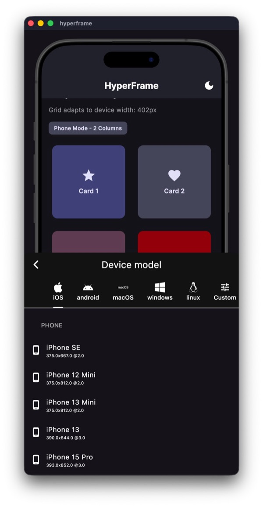
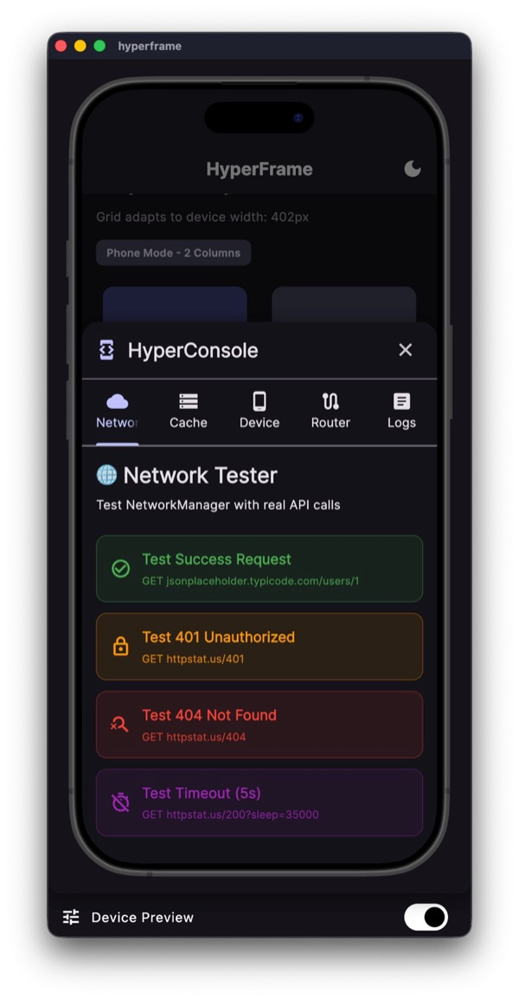
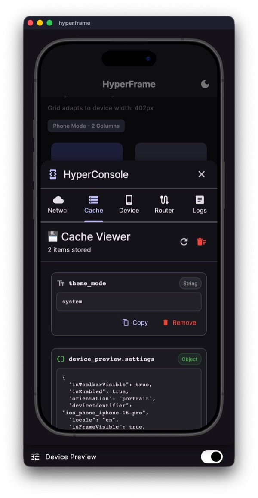
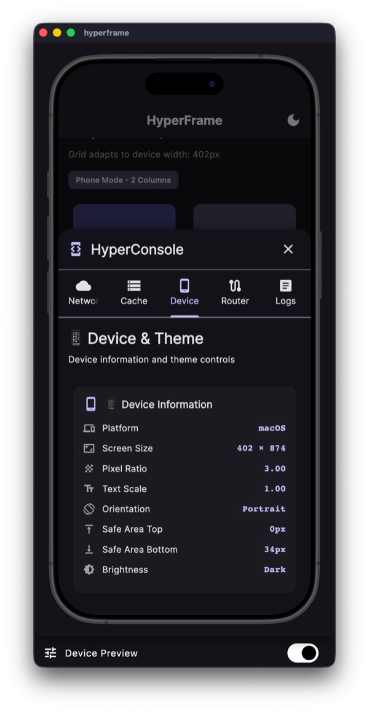
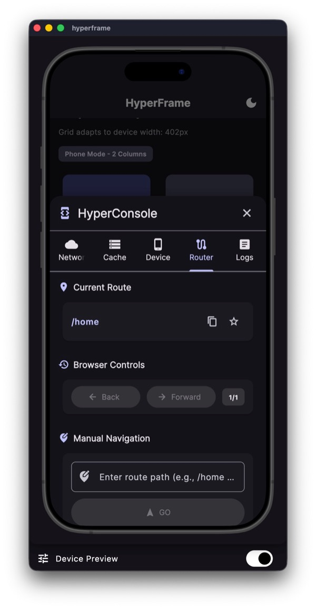
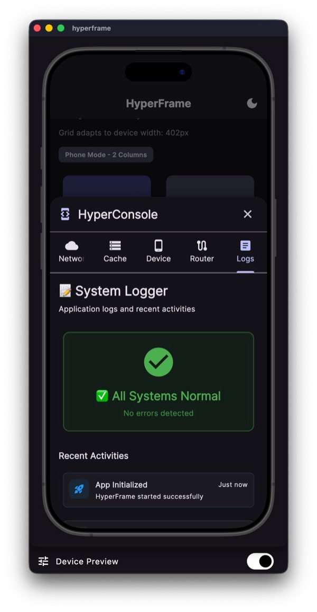

# 🚀 HyperFrame - Stop burning your CPU



> **The Ultimate Flutter Development Workbench with Built-in Developer Cockpit**

HyperFrame is a blazing-fast Flutter development environment that runs mobile apps as native desktop apps with device frame simulation. Say goodbye to slow emulators and hello to instant hot reloads **plus** a powerful runtime debugging suite!

---

## 🎯 Why HyperFrame?

Traditional mobile development requires running heavy emulators that consume massive CPU resources and drain your battery. **HyperFrame changes everything** - and includes **HyperConsole**, your built-in developer cockpit for runtime debugging.

### **Key Benefits:**

| Feature | Traditional Emulator | HyperFrame + HyperConsole |
|---------|---------------------|---------------------------|
| **Speed** | Slow startup (30s+) | Instant (< 5s) ⚡️ |
| **CPU Usage** | 40-60% constant load | < 10% 🔋 |
| **Hot Reload** | 2-5 seconds | < 1 second 🔥 |
| **API Testing** | Need Postman | Built-in Network Tab 🌐 |
| **Cache Debug** | Manual logging | Live Cache Inspector 💾 |
| **Navigation Debug** | Manual tracking | Browser-like History 🧭 |
| **Battery Impact** | Drains rapidly | Minimal usage 🌱 |
| **Multi-Device** | One at a time | Switch instantly 📱 |

---

## ✨ Features

### Core Development Experience
- **⚡️ Native Performance** - 10x faster than Android Emulator
- **📱 Multi-Device Simulation** - iPhone, Pixel, iPad in one click
- **🔋 Battery Saver** - No heavy virtualization
- **🎨 Instant Theme Testing** - Toggle dark/light mode instantly
- **📐 Responsive Layout Validation** - Test different screen sizes live
- **🛠 Developer Experience** - Hot reload in milliseconds

### 🔥 HyperConsole - Built-in Developer Cockpit
**One tap. Five powerful tools. Zero external dependencies.**

- **🌐 Network Tester** - Full REST client with mock data generation
- **💾 Cache Inspector** - View, search, and clear app cache in real-time
- **🎨 Theme & Device Tab** - Instant theme preview + device information
- **🧭 Router Manager** - Browser-like navigation with history & favorites ⭐
- **📊 Live Logger** - Real-time filtered logs with search

[**📖 Full HyperConsole Documentation →**](docs/HYPERCONSOLE.md)

### Architecture & Quality
- **🏗 Clean Architecture** - Feature-first structure
- **🔄 Riverpod State Management** - Type-safe, reactive state
- **🧭 GoRouter Navigation** - Declarative routing with deep linking
- **🌍 Cross-Platform Desktop** - Works on macOS, Windows, Linux
- **🎯 Zero Configuration** - Just clone and run

---

## 🚦 Quick Start

### Prerequisites

- Flutter 3.10+ installed
- macOS 10.14+ (or Windows 10+ / Linux Ubuntu 20.04+)
- Xcode Command Line Tools (macOS only)

### Installation

```bash
# 1. Clone the repository
git clone https://github.com/aeTunga/HyperFrame.git
cd HyperFrame

# 2. Get dependencies
flutter pub get

# 3. Generate Riverpod code (REQUIRED - run after every git pull!)
dart run build_runner build --delete-conflicting-outputs

# 4. Run on macOS (or your desktop platform)
flutter run -d macos
```

### 🎯 Opening HyperConsole

After the app launches, look for the **blue floating button** in the bottom-left corner.

- **Tap** → Opens HyperConsole with 5 debug tabs
- **Long Press + Drag** → Repositions the button

---

## 🛠 HyperConsole Overview

### The 5 Power Tabs

#### 1️⃣ Network Tester
Test APIs without leaving your app. Full REST client with request history.



```dart
// Test your backend instantly
GET https://api.example.com/users/123
POST https://api.example.com/auth/login
```

**Features:** Live API testing, request history, mock user generation, custom headers, formatted JSON responses.

---

#### 2️⃣ Cache Inspector
View and manipulate local storage in real-time. Debug persistence issues instantly.



```dart
// See all cached data
theme_mode → "dark"
user_token → "eyJhbGc..."
onboarding_complete → true
```

**Features:** View all cache, search filter, individual/bulk clear, type display, live updates.

---

#### 3️⃣ Device & Theme Tab
Switch between light/dark/system themes without rebuilding. View device specs.



**Features:** Live theme switching, device information, safe area display, brightness control, real-time updates.

---

#### 4️⃣ Router Manager ⭐ NEW
Browser-like navigation debugging with history, favorites, and manual route testing.



```dart
// Navigate to any route
/user/123?edit=true
/admin/dashboard

// Features: Back/Forward, History (last 20), Favorites (persistent)
```

**Features:** Current route display, manual navigation, back/forward buttons, history (last 20), favorites, quick access chips.

---

#### 5️⃣ Logger Tab
Real-time application logs with filtering. Copy logs for bug reports.



**Features:** Live log stream, log levels (Info/Warning/Error), search filter, auto-scroll, copy logs, clear logs.

---

[**📖 Full HyperConsole Documentation →**](docs/HYPERCONSOLE.md)

---

## 📱 Switching Devices

Want to test on a different device? It's incredibly simple:

1. **Use the Toolbar** - Click the device selector in the top toolbar (when app is running)
2. **Or Edit Code** - Open `lib/main.dart` and uncomment your desired device:

```dart
// Line ~45 in lib/main.dart
defaultDevice: Devices.ios.iPhone16ProMax,          // Current (iPhone)
// defaultDevice: Devices.android.pixel6,           // Uncomment for Pixel 6
// defaultDevice: Devices.ios.iPad12InchGen4,       // Uncomment for iPad
// defaultDevice: Devices.android.samsungGalaxyS20, // Uncomment for Samsung
```

**Available Devices:**
- **iOS:** iPhone SE, 13 Mini, 13, 13 Pro Max, 16 Pro Max, iPad Pro 11", iPad 12.9"
- **Android:** Pixel 4/5/6, Samsung Galaxy S20/Note20/A50, OnePlus 8 Pro

---

## 💻 Code Examples

### Using NetworkManager (Type-Safe Generics)

```dart
import 'package:hyperframe/core/network/network_manager.dart';
import 'package:hyperframe/core/network/http_method.dart';

final networkManager = NetworkManager();

// Type-safe GET request
final response = await networkManager.request<User>(
  '/users/123',
  method: HttpMethod.get,
  parser: (json) => User.fromJson(json),
);

// Handle result
response.when(
  success: (user) => print('Welcome ${user.name}!'),
  failure: (error) => print('Error: ${error.message}'),
);

// POST with body
final createResponse = await networkManager.request<User>(
  '/users',
  method: HttpMethod.post,
  data: {'name': 'John', 'email': 'john@example.com'},
  parser: (json) => User.fromJson(json),
);
```

### Using CacheManager

```dart
import 'package:hyperframe/core/caching/cache_manager.dart';
import 'package:hyperframe/core/constants/cache_keys.dart';

final cacheManager = CacheManager();

// Store primitives
await cacheManager.setString(CacheKeys.userToken, 'abc123');
await cacheManager.setInt('user_id', 42);
await cacheManager.setBool('onboarding_complete', true);

// Store JSON objects
await cacheManager.setJson('user_profile', user.toJson());

// Retrieve data
final token = await cacheManager.getString(CacheKeys.userToken);
final profile = await cacheManager.getJson('user_profile');

// Check & remove
if (await cacheManager.containsKey(CacheKeys.userToken)) {
  await cacheManager.remove(CacheKeys.userToken);
}

// Clear all (use with caution!)
await cacheManager.clear();
```

### Using Riverpod State Management

```dart
import 'package:flutter_riverpod/flutter_riverpod.dart';
import 'package:riverpod_annotation/riverpod_annotation.dart';

part 'my_controller.g.dart';

// Auto-generated provider with code generation
@riverpod
class Counter extends _$Counter {
  @override
  int build() => 0;

  void increment() => state++;
  void decrement() => state--;
}

// In your widget
class MyWidget extends ConsumerWidget {
  @override
  Widget build(BuildContext context, WidgetRef ref) {
    final count = ref.watch(counterProvider);
    
    return Text('Count: $count');
  }
}
```

### Custom Logging for HyperConsole

```dart
import 'package:hyperframe/core/init/log_helper.dart';

class MyService {
  Future<void> fetchData() async {
    LogHelper.info('Starting data fetch...');
    
    try {
      final data = await api.getData();
      LogHelper.info('Fetched ${data.length} items');
    } catch (e, stackTrace) {
      LogHelper.error('Fetch failed', error: e, stackTrace: stackTrace);
    }
  }
}
```

---

## 📂 Project Structure

```
hyperframe/
├── lib/
│   ├── main.dart                          # Smart runner with platform detection
│   ├── app.dart                           # MaterialApp with routing
│   ├── core/
│   │   ├── console/                      # 🆕 HyperConsole Developer Cockpit
│   │   │   ├── widgets/
│   │   │   │   ├── tabs/
│   │   │   │   │   ├── network_tester_tab.dart
│   │   │   │   │   ├── cache_viewer_tab.dart
│   │   │   │   │   ├── device_theme_tab.dart
│   │   │   │   │   ├── router_tab.dart        # ⭐ Browser-like navigation
│   │   │   │   │   └── logger_tab.dart
│   │   │   │   ├── hyper_console_button.dart  # Floating access button
│   │   │   │   └── hyper_console_sheet.dart   # Bottom sheet container
│   │   │   └── models/
│   │   ├── router/                       # 🆕 GoRouter navigation
│   │   │   └── app_router.dart          # Declarative routing
│   │   ├── network/                      # 🆕 NetworkManager + Dio
│   │   │   ├── interceptors/            # Error & logging interceptors
│   │   │   ├── exceptions/              # Network exceptions
│   │   │   └── network_manager.dart     # Type-safe HTTP client
│   │   ├── caching/                      # 🆕 CacheManager
│   │   │   └── cache_manager.dart       # Persistent local storage
│   │   ├── theme/
│   │   │   ├── app_theme.dart           # Material 3 themes
│   │   │   └── theme_provider.dart      # Theme state management
│   │   ├── init/                         # 🆕 App initialization
│   │   │   ├── app_initializer.dart     # Service bootstrapping
│   │   │   └── log_helper.dart          # Logging utilities
│   │   ├── constants/                    # 🆕 App constants
│   │   ├── extensions/                   # 🆕 Dart extensions
│   │   └── utils/                        # 🆕 Platform utilities
│   ├── features/                         # 🆕 Feature-first structure
│   │   ├── home/
│   │   │   └── presentation/
│   │   │       ├── home_controller.dart # Riverpod controller
│   │   │       ├── home_view.dart       # UI
│   │   │       └── widgets/             # Feature widgets
│   │   └── splash/
│   │       └── presentation/
│   └── shared/                           # 🆕 Shared widgets
│       └── widgets/
│           ├── device_info_card.dart
│           └── responsive_grid.dart
├── docs/                                  # 🆕 Documentation
│   └── HYPERCONSOLE.md                   # Full console docs
├── test/                                  # 🆕 Unit tests
│   └── core/caching/
│       └── cache_manager_test.dart
├── macos/                                 # Desktop configurations
├── ios/
├── android/
└── pubspec.yaml
```

---

## 🛠 Architecture Highlights

### **Smart Runner Logic** (`lib/main.dart`)

```dart
import 'package:hyperframe/core/utils/platform_utils.dart';

final bool enableSimulator = PlatformUtils.shouldEnableSimulation;

if (enableSimulator) {
  // Desktop debug: DevicePreview + Riverpod + HyperConsole
  runApp(ProviderScope(
    child: DevicePreview(
      enabled: true,
      builder: (context) => const MyApp(),
    ),
  ));
} else {
  // Mobile/Release: Standard Flutter app
  runApp(const ProviderScope(child: MyApp()));
}
```

### **HyperConsole Integration via ShellRoute**

HyperConsole's floating button is injected through GoRouter's `ShellRoute`, ensuring it has Navigator access:

```dart
// lib/core/router/app_router.dart
GoRouter(
  navigatorKey: rootNavigatorKey,
  routes: [
    ShellRoute(
      builder: (context, state, child) {
        if (kDebugMode) {
          return Stack(
            children: [
              child,
              const HyperConsoleButton(),  // Injected on all pages
            ],
          );
        }
        return child;
      },
      routes: [/* all app routes */],
    ),
  ],
)
```

### **State Management with Riverpod**

Uses Riverpod with code generation for type-safe, reactive state:

```dart
@riverpod
class Counter extends _$Counter {
  @override
  int build() => 0;
  
  void increment() => state++;
}

// Auto-generates: counterProvider
```

### **Technology Stack**

#### Core Dependencies
```yaml
dependencies:
  flutter_riverpod: ^3.0.3          # State management
  riverpod_annotation: ^3.0.3       # Code generation
  go_router: ^17.0.0                # Declarative navigation
  dio: ^5.9.0                       # HTTP client
  shared_preferences: ^2.5.3        # Persistent storage
  logger: ^2.6.2                    # Logging
  google_fonts: ^6.1.0              # Typography
  device_preview: ^1.3.1            # Device simulation
  equatable: ^2.0.7                 # Value equality

dev_dependencies:
  riverpod_generator: ^3.0.3        # Provider code generation
  build_runner: ^2.10.4             # Code generation runner
  mockito: ^5.4.4                   # Testing mocks
  http_mock_adapter: ^0.6.1         # Network testing
```

---

## 🧪 Testing

Run the included tests to verify HyperFrame functionality:

```bash
# Run all tests
flutter test

# Run specific test suite
flutter test test/core/caching/cache_manager_test.dart

# Run tests with coverage
flutter test --coverage

# Run tests in watch mode (re-run on changes)
flutter test --watch
```

**Included Tests:**
- ✅ CacheManager persistence tests
- ✅ NetworkManager mock tests
- ✅ Widget tests for key components
- ✅ Theme switching tests

---

## 🌐 Platform Support

| Platform | Status | Notes |
|----------|--------|-------|
| **macOS** | ✅ Fully Supported | Primary development platform |
| **Windows** | ✅ Supported | Requires Flutter desktop enabled |
| **Linux** | ✅ Supported | Requires Flutter desktop enabled |
| **iOS** | ⚠️ Standard Mode | No simulation (use real device/simulator) |
| **Android** | ⚠️ Standard Mode | No simulation (use real device/emulator) |
| **Web** | 🚧 Experimental | DevicePreview works, some features limited |

---

## 🐛 Troubleshooting

### **Issue: DevicePreview not showing**

**Solution:** Ensure you're running in debug mode on a desktop platform:

```bash
flutter run -d macos --debug
```

### **Issue: HyperConsole button not visible**

**Solution:** The button only appears in debug mode on desktop:
- Verify you're running `flutter run -d macos` (not release mode)
- The button is at the bottom-left corner
- Hot restart with `R` if needed

### **Issue: Build runner errors**

**Solution:** Clean and rebuild generated files:

```bash
flutter clean
flutter pub get
dart run build_runner build --delete-conflicting-outputs
```

### **Issue: Navigator errors in HyperConsole**

**Solution:** This should be fixed with ShellRoute architecture. If you still see errors:
1. Ensure you've run build_runner (step above)
2. Hot restart the app with `R`
3. Check that you're on the latest code

### **Issue: Fonts not loading**

**Solution:** Clear Flutter cache and rebuild:

```bash
flutter clean
flutter pub get
flutter run -d macos
```

### **Issue: Hot reload is slow**

**Solution:** This shouldn't happen with HyperFrame! If it does:
1. Verify you're running on desktop (not mobile emulator)
2. Check Activity Monitor for other resource-heavy processes
3. Restart the app with `R` (hot restart)

---

## 🤝 Contributing

Contributions are welcome! Here's how you can help:

1. **Fork the repository**
2. **Create a feature branch** (`git checkout -b feature/amazing-feature`)
3. **Commit your changes** (`git commit -m 'Add amazing feature'`)
4. **Push to the branch** (`git push origin feature/amazing-feature`)
5. **Open a Pull Request**

### Development Guidelines

- Follow Flutter best practices and linting rules
- Maintain Material 3 design consistency
- Add tests for new features
- Update documentation (especially [HYPERCONSOLE.md](docs/HYPERCONSOLE.md))
- Run `flutter analyze` before committing
- Use Riverpod with code generation for new state

### Areas for Contribution

- 🆕 New HyperConsole tabs (GraphQL tester, performance monitor, etc.)
- 🎨 Theme customization options
- 🌍 Internationalization support
- 📱 More device presets
- 🧪 Additional tests and coverage
- 📖 Documentation improvements

---

## 📋 Requirements

### Minimum Flutter Version

```yaml
environment:
  sdk: ^3.10.3
```

### System Requirements

- **macOS:** 10.14+ (Mojave or later)
- **Windows:** 10+ (with Flutter desktop enabled)
- **Linux:** Ubuntu 20.04+ (with Flutter desktop enabled)
- **Memory:** 4GB RAM minimum, 8GB recommended
- **Storage:** 2GB free space for Flutter + dependencies

---

## 💡 Pro Tips

### Development Workflow

1. **Use HyperConsole for everything** - Stop switching to external tools
2. **Favorite your routes** - Star frequently used routes in Router tab
3. **Test APIs in-app** - Use Network tab instead of Postman
4. **Monitor cache** - Check Cache tab when debugging persistence
5. **Live logging** - Keep Logger tab open during development

### Keyboard Shortcuts

- `r` in terminal → Hot reload (< 1 second)
- `R` in terminal → Hot restart (resets state)
- `q` in terminal → Quit app
- `h` in terminal → Show all shortcuts

### HyperConsole Tips

- **Network Tab:** Generate mock users for quick API testing
- **Cache Tab:** Search feature is your friend for large datasets
- **Router Tab:** Use back/forward like a browser to debug navigation
- **Logger Tab:** Filter by error level to focus on issues
- **Button:** Drag it anywhere - position persists during session

### Production Deployment

HyperConsole is **completely stripped** from release builds:

```bash
# HyperConsole will NOT be included
flutter build apk --release
flutter build ios --release
flutter build macos --release
```

Zero overhead. Zero bloat. Just your production app.

---

## 📄 License

MIT License

Copyright (c) 2025 HyperFrame

Permission is hereby granted, free of charge, to any person obtaining a copy
of this software and associated documentation files (the "Software"), to deal
in the Software without restriction, including without limitation the rights
to use, copy, modify, merge, publish, distribute, sublicense, and/or sell
copies of the Software, and to permit persons to whom the Software is
furnished to do so, subject to the following conditions:

The above copyright notice and this permission notice shall be included in all
copies or substantial portions of the Software.

THE SOFTWARE IS PROVIDED "AS IS", WITHOUT WARRANTY OF ANY KIND, EXPRESS OR
IMPLIED, INCLUDING BUT NOT LIMITED TO THE WARRANTIES OF MERCHANTABILITY,
FITNESS FOR A PARTICULAR PURPOSE AND NONINFRINGEMENT. IN NO EVENT SHALL THE
AUTHORS OR COPYRIGHT HOLDERS BE LIABLE FOR ANY CLAIM, DAMAGES OR OTHER
LIABILITY, WHETHER IN AN ACTION OF CONTRACT, TORT OR OTHERWISE, ARISING FROM,
OUT OF OR IN CONNECTION WITH THE SOFTWARE OR THE USE OR OTHER DEALINGS IN THE
SOFTWARE.

---

## 🌟 Star this repo!

If HyperFrame + HyperConsole saves you time and battery life, give it a star! It helps others discover this tool.

[](https://github.com/aeTunga/HyperFrame)

---

## 📬 Contact & Support

- **Issues:** [GitHub Issues](https://github.com/aeTunga/HyperFrame/issues)
- **Discussions:** [GitHub Discussions](https://github.com/aeTunga/HyperFrame/discussions)
- **HyperConsole Docs:** [docs/HYPERCONSOLE.md](docs/HYPERCONSOLE.md)

---

**Built with ❤️ for the Flutter community**

*Stop burning your CPU. Start building with HyperConsole.*

🚀 **HyperFrame: Where performance meets productivity.**
