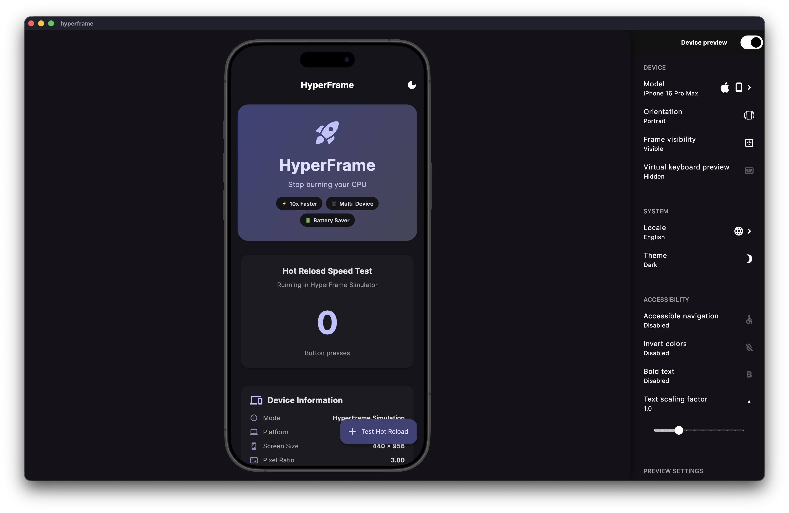

# 🚀 HyperFrame - Stop burning your CPU

> **The Ultimate macOS Mobile Workbench for Flutter Development**

HyperFrame is a blazing-fast Flutter development environment that runs mobile apps as native desktop apps with device frame simulation. Say goodbye to slow emulators and hello to instant hot reloads!

---

## 🎯 Why HyperFrame?

Traditional mobile development requires running heavy emulators that consume massive CPU resources and drain your battery. **HyperFrame changes everything.**

### **Key Benefits:**

| Feature | Traditional Emulator | HyperFrame |
|---------|---------------------|------------|
| **Speed** | Slow startup (30s+) | Instant (< 5s) ⚡️ |
| **CPU Usage** | 40-60% constant load | < 10% 🔋 |
| **Hot Reload** | 2-5 seconds | < 1 second 🔥 |
| **Battery Impact** | Drains rapidly | Minimal usage 🌱 |
| **Multi-Device** | One at a time | Switch instantly 📱 |

---

## ✨ Features

- **⚡️ Native Performance** - 10x faster than Android Emulator
- **📱 Multi-Device Simulation** - iPhone, Pixel, iPad in one click
- **🔋 Battery Saver** - No heavy virtualization
- **🎨 Instant Theme Testing** - Toggle dark/light mode instantly
- **📐 Responsive Layout Validation** - Test different screen sizes live
- **🛠 Developer Experience** - Hot reload in milliseconds
- **🌍 Cross-Platform Desktop** - Works on macOS, Windows, Linux
- **🎯 Zero Configuration** - Just clone and run

---

## 🚦 Quick Start

### Prerequisites

- Flutter 3.0+ installed
- macOS 10.14+ (or Windows 10+ / Linux Ubuntu 20.04+)
- Xcode Command Line Tools (macOS only)

### Installation

```bash
# 1. Clone the repository
git clone https://github.com/aeTunga/HyperFrame.git
cd HyperFrame

# 2. Get dependencies
flutter pub get

# 3. Generate Riverpod code (REQUIRED - run after every git pull!)
dart run build_runner build --delete-conflicting-outputs

# 4. Run on macOS (or your desktop platform)
flutter run -d macos
```

That's it! HyperFrame will launch with an iPhone 16 Pro Max simulation by default.

---

## 📱 Switching Devices

Want to test on a different device? It's incredibly simple:

1. **Use the Toolbar** - Click the device selector in the top toolbar (when app is running)
2. **Or Edit Code** - Open `lib/main.dart` and uncomment your desired device:

```dart
// Line ~38 in lib/main.dart
defaultDevice: Devices.ios.iPhone16ProMax,          // Current (iPhone)
// defaultDevice: Devices.android.pixel6,           // Uncomment for Pixel 6
// defaultDevice: Devices.ios.iPad12InchGen4,       // Uncomment for iPad
// defaultDevice: Devices.android.samsungGalaxyS20, // Uncomment for Samsung
```

**Available Devices:**
- **iOS:** iPhone SE, 13 Mini, 13, 13 Pro Max, iPad Pro 11", iPad 12.9"
- **Android:** Pixel 4/5/6, Samsung Galaxy S20/Note20, OnePlus 8 Pro

---

## 🎨 Features Showcase

### 1️⃣ **Smart Platform Detection**

HyperFrame automatically detects your platform:
- **Debug Mode + Desktop** → Runs with DevicePreview
- **Release Mode or Mobile** → Runs as standard Flutter app

No performance overhead in production!

### 2️⃣ **Instant Theme Testing**

Click the theme toggle in the app bar to switch between light/dark modes instantly. Perfect for:
- Testing color schemes
- Validating text contrast
- Ensuring UI consistency

### 3️⃣ **Responsive Layout Validation**

The built-in grid demo automatically adapts to device width:
- **Phone (< 600px):** 2 columns
- **Tablet (600-900px):** 3 columns
- **Desktop (> 900px):** 4 columns

### 4️⃣ **Device Information Display**

Real-time display of:
- Current simulated device
- Screen dimensions
- Pixel ratio
- Platform info

---

## 📂 Project Structure

```
hyperframe/
├── lib/
│   ├── main.dart                 # Smart runner with platform detection
│   ├── app.dart                  # Main app with DevicePreview config
│   ├── theme/
│   │   ├── app_theme.dart       # Light/Dark theme definitions
│   │   └── theme_provider.dart  # Theme state management
│   ├── screens/
│   │   └── home_screen.dart     # Demo home screen
│   └── widgets/
│       ├── device_info_card.dart   # Device information display
│       └── responsive_grid.dart    # Responsive layout demo
├── macos/                        # macOS desktop configuration
├── ios/                          # iOS configuration
├── android/                      # Android configuration
└── pubspec.yaml                  # Dependencies
```

---

## 🛠 Architecture Highlights

### **Smart Runner Logic** (`lib/main.dart`)

```dart
final bool isDesktop = Platform.isMacOS || 
                       Platform.isWindows || 
                       Platform.isLinux;

final bool enableSimulator = kDebugMode && isDesktop;

if (enableSimulator) {
  runApp(DevicePreview(...));  // Desktop debug mode
} else {
  runApp(MyApp());             // Mobile or release mode
}
```

### **Theme Management**

Uses `Provider` pattern with `ChangeNotifier` for simple, reactive theme switching:

```dart
class ThemeProvider extends ChangeNotifier {
  ThemeMode _themeMode = ThemeMode.system;
  
  void toggleTheme() {
    _themeMode = _themeMode == ThemeMode.light 
        ? ThemeMode.dark 
        : ThemeMode.light;
    notifyListeners();
  }
}
```

### **Technology Stack**

- **Flutter 3.10+** - Cross-platform framework
- **device_preview** - Device frame simulation
- **provider** - State management
- **google_fonts** - Modern typography
- **Material 3** - Latest design system

---

## 🧪 Testing

Run the included tests to verify HyperFrame functionality:

```bash
# Run all tests
flutter test

# Run tests with coverage
flutter test --coverage
```

**Included Tests:**
- App loads successfully
- Counter increments correctly
- Theme toggle works
- Responsive layout adapts

---

## 🌐 Platform Support

| Platform | Status | Notes |
|----------|--------|-------|
| **macOS** | ✅ Fully Supported | Primary development platform |
| **Windows** | ✅ Supported | Requires Flutter desktop enabled |
| **Linux** | ✅ Supported | Requires Flutter desktop enabled |
| **iOS** | ⚠️ Standard Mode | No simulation (use real device/simulator) |
| **Android** | ⚠️ Standard Mode | No simulation (use real device/emulator) |

---

## 🤝 Contributing

Contributions are welcome! Here's how you can help:

1. **Fork the repository**
2. **Create a feature branch** (`git checkout -b feature/amazing-feature`)
3. **Commit your changes** (`git commit -m 'Add amazing feature'`)
4. **Push to the branch** (`git push origin feature/amazing-feature`)
5. **Open a Pull Request**

### Development Guidelines

- Follow Flutter best practices
- Maintain Material 3 design consistency
- Add tests for new features
- Update documentation as needed

---

## 📋 Requirements

### Minimum Flutter Version

```yaml
environment:
  sdk: ^3.10.3
```

### Key Dependencies

```yaml
dependencies:
  flutter_localizations: sdk
  google_fonts: ^6.1.0
  provider: ^6.1.0

dev_dependencies:
  device_preview: ^1.2.0
  flutter_lints: ^6.0.0
```

---

## 🐛 Troubleshooting

### **Issue: DevicePreview not showing**

**Solution:** Ensure you're running in debug mode on a desktop platform:

```bash
flutter run -d macos --debug
```

### **Issue: Fonts not loading**

**Solution:** Clear Flutter cache and rebuild:

```bash
flutter clean
flutter pub get
flutter run -d macos
```

### **Issue: Hot reload is slow**

**Solution:** This shouldn't happen with HyperFrame! If it does:
1. Verify you're running on desktop (not mobile emulator)
2. Check Activity Monitor for other resource-heavy processes
3. Restart the app

---

## 📄 License

MIT License

Copyright (c) 2025 HyperFrame

Permission is hereby granted, free of charge, to any person obtaining a copy
of this software and associated documentation files (the "Software"), to deal
in the Software without restriction, including without limitation the rights
to use, copy, modify, merge, publish, distribute, sublicense, and/or sell
copies of the Software, and to permit persons to whom the Software is
furnished to do so, subject to the following conditions:

The above copyright notice and this permission notice shall be included in all
copies or substantial portions of the Software.

THE SOFTWARE IS PROVIDED "AS IS", WITHOUT WARRANTY OF ANY KIND, EXPRESS OR
IMPLIED, INCLUDING BUT NOT LIMITED TO THE WARRANTIES OF MERCHANTABILITY,
FITNESS FOR A PARTICULAR PURPOSE AND NONINFRINGEMENT. IN NO EVENT SHALL THE
AUTHORS OR COPYRIGHT HOLDERS BE LIABLE FOR ANY CLAIM, DAMAGES OR OTHER
LIABILITY, WHETHER IN AN ACTION OF CONTRACT, TORT OR OTHERWISE, ARISING FROM,
OUT OF OR IN CONNECTION WITH THE SOFTWARE OR THE USE OR OTHER DEALINGS IN THE
SOFTWARE.

---

## 💡 Pro Tips

1. **Use keyboard shortcuts** - Press `r` in terminal for hot reload, `R` for hot restart
2. **Multiple screens** - Add more screens to test navigation in simulation
3. **API testing** - Network requests work perfectly in simulation mode
4. **Screenshot mode** - Use DevicePreview's built-in screenshot feature
5. **Locale testing** - Switch locales in the toolbar to test internationalization

---

## 🌟 Star this repo!

If HyperFrame saves you time and battery life, give it a star! It helps others discover this tool.

[](https://github.com/aeTunga/HyperFrame)

---

## 📬 Contact & Support

- **Issues:** [GitHub Issues](https://github.com/aeTunga/HyperFrame/issues)
- **Discussions:** [GitHub Discussions](https://github.com/aeTunga/HyperFrame/discussions)

---

**Built with ❤️ for the Flutter community**

*Stop burning your CPU. Start building amazing apps.*
